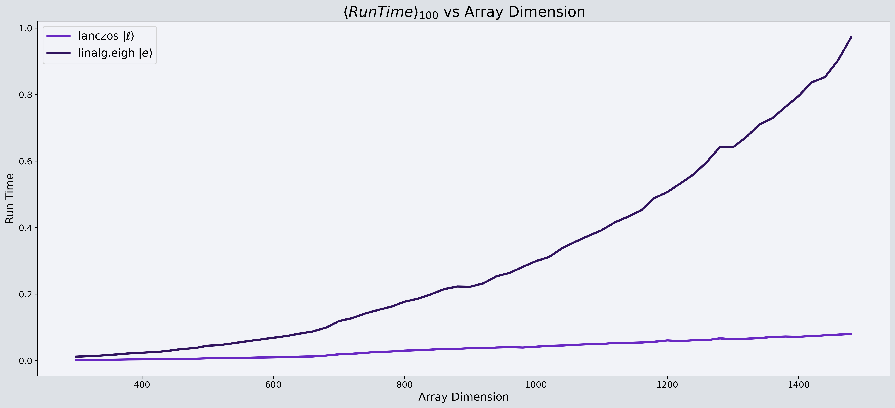
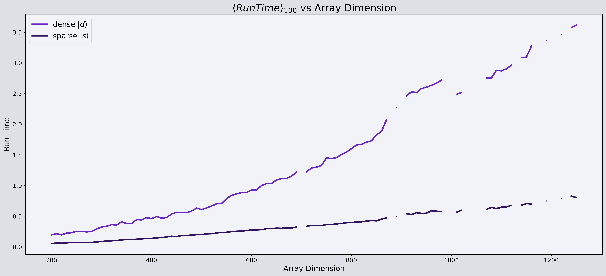

# Goal
Implement lanczos algorithm for time evolution in qiskit dynamics

Results of lanczos implementation using dense numpy arrays

Results of lanczos on dense ndarray vs sparse scipy csr matrix

presentation of [checkpoint-1](https://github.com/rupeshknn/lanczos-QD/blob/main/presentations/Checkpoint_1-Lanczos_Algorithm_for_Qiskit_Dynamics.pdf)
